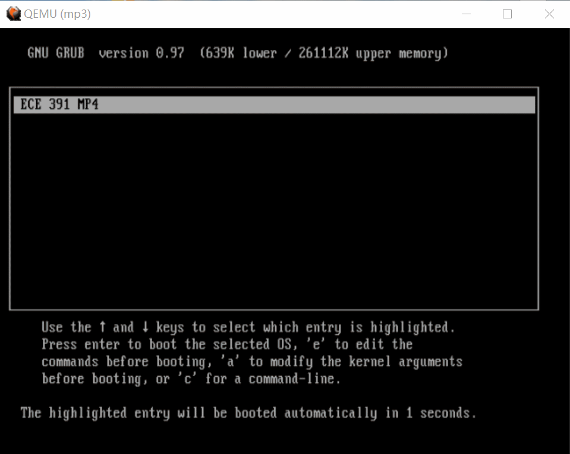
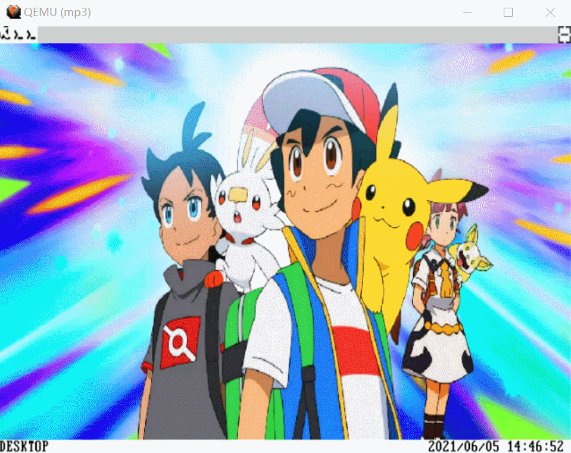
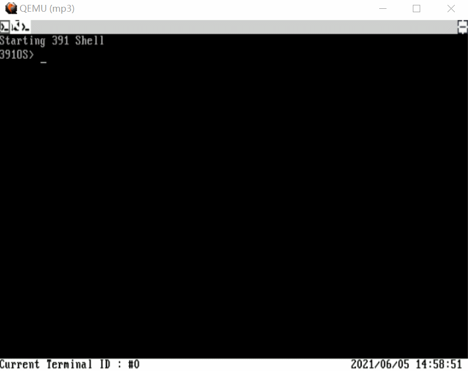
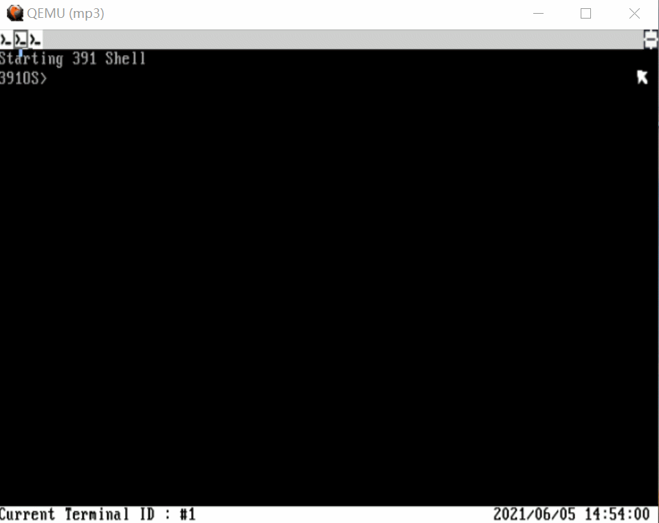

## Overview

This is a tiny but fully functional Linux-like operating system kernel. I am fortunate to work with wonderful teammates: [Zhongbo Zhu](https://www.linkedin.com/in/zhongbo-zhu-2b63b71b4/) (myself), [Jiaqi Lou](https://www.linkedin.com/in/jiaqi-garbo-lou-601b02168/), [Xinyu Lian](https://www.linkedin.com/in/xinyu-lian-b69372212/), [Tianyu Liu](https://www.linkedin.com/in/tianyu-liu-776b44220/).                        

## Feature

BASIC FUNCTION

- Support basic interrupt (keyboard, rtc, pit, etc.).
- Support read-only file system.
- Support basic system call.
- Support three terminals at most and process switch function.

VGA RELATED

- Allow to switch VGA mode 16 color and VGA mode 32 color.
- Provide background picture for desktop.
- Support animation of system entry.
- Support using mouse (by clicking `left button`) and keyboard (by pressing `ALT+F1/F2/F3/F4`) to switch different terminals and desktop.
- Support status bar display.
- Support cursor display.

DEVICE RELATED

- Support Peripheral Component Interconnect (PCI) bus.
- Support a speaker.
- Support mouse.
- Support receiving the system time from CMOS and print it on the status bar.

COMMAND RELATED

- Support auto-complete function for command (by pressing **tab**).
- Support history information buffer, whose maximum limit is 135 (by using **arrow up** and **arrow down**).

SIGNAL RELATED

- Provide a common API for idt content.
- Support five different signal mechanism.
- Enable system call: set signal handler and signal return.

SYSTEM CALL RELATED

- Support music play function (**beep**).
- Support random number generation, whose form is a guessing game (**random**).

## How to run

If using latest QEMU:

`qemu-system-i386 -hda "student-distrib/mp3.img" -m 512 -name test -gdb tcp:127.0.0.1:1234 -soundhw pcspk -soundhw sb16 -serial /dev/ttyUSB0`

If using QEMU provided by this course:

- QEMU VGA needs to be enabled explicitly `-vga std`
- ACPI doesn't work

`qemu-system-i386 -hda "student-distrib/mp3.img" -m 512 -name test -gdb tcp:127.0.0.1:1234 -soundhw pcspk -soundhw sb16 -serial /dev/ttyUSB0 -vga std`

## Demo

#### Boot 
we can also see the desktop and the status bar in the buttom with location and time.

------

#### Cursor Display
The self-designed cursor can open a new terminal and close it smoothly.

------

**Terminal**
The terimal can continue to run the program when it is minimized.

------

#### CMD history
The terminal can support auto code completion and command history switch by pressing up button.

------

#### Other operations

------

#### Signal
We can use “CRTL+C” to terminal the current program, which is the signal part in linux kernel.

ACADEMIC INTEGRITY
-----

Please review the University of Illinois Student Code before starting,
particularly all subsections of Article 1, Part 4 Academic Integrity and Procedure [here](https://studentcode.illinois.edu/article1/part4/1-401/).

**§ 1‑402 Academic Integrity Infractions**

(a).	Cheating. No student shall use or attempt to use in any academic exercise materials, information, study aids, or electronic data that the student knows or should know is unauthorized. Instructors are strongly encouraged to make in advance a clear statement of their policies and procedures concerning the use of shared study aids, examination files, and related materials and forms of assistance. Such advance notification is especially important in the case of take-home examinations. During any examination, students should assume that external assistance (e.g., books, notes, calculators, and communications with others) is prohibited unless specifically authorized by the Instructor. A violation of this section includes but is not limited to:

(1)	Allowing others to conduct research or prepare any work for a student without prior authorization from the Instructor, including using the services of commercial term paper companies. 

(2)	Submitting substantial portions of the same academic work for credit more than once or by more than one student without authorization from the Instructors to whom the work is being submitted. 

(3) Working with another person without authorization to satisfy an individual assignment.

(b) Plagiarism. No student shall represent the words, work, or ideas of another as his or her own in any academic endeavor. A violation of this section includes but is not limited to:

(1)	Copying: Submitting the work of another as one’s own. 

(2)	Direct Quotation: Every direct quotation must be identified by quotation marks or by appropriate indentation and must be promptly cited. Proper citation style for many academic departments is outlined in such manuals as the MLA Handbook or K.L. Turabian’s A Manual for Writers of Term Papers, Theses and Dissertations. These and similar publications are available in the University bookstore or library. The actual source from which cited information was obtained should be acknowledged.

(3)	Paraphrase: Prompt acknowledgment is required when material from another source is paraphrased or summarized in whole or in part. This is true even if the student’s words differ substantially from those of the source. A citation acknowledging only a directly quoted statement does not suffice as an acknowledgment of any preceding or succeeding paraphrased material. 

(4)	Borrowed Facts or Information: Information obtained in one’s reading or research that is not common knowledge must be acknowledged. Examples of common knowledge might include the names of leaders of prominent nations, basic scientific laws, etc. Materials that contribute only to one’s general understanding of the subject may be acknowledged in a bibliography and need not be immediately cited. One citation is usually sufficient to acknowledge indebtedness when a number of connected sentences in the paper draw their special information from one source.

(c) Fabrication. No student shall falsify or invent any information or citation in an academic endeavor. A violation of this section includes but is not limited to:

(1)	Using invented information in any laboratory experiment or other academic endeavor without notice to and authorization from the Instructor or examiner. It would be improper, for example, to analyze one sample in an experiment and covertly invent data based on that single experiment for several more required analyses. 

(2)	Altering the answers given for an exam after the examination has been graded. 

(3)	Providing false or misleading information for the purpose of gaining an academic advantage.

(d)	Facilitating Infractions of Academic Integrity. No student shall help or attempt to help another to commit an infraction of academic integrity, where one knows or should know that through one’s acts or omissions such an infraction may be facilitated. A violation of this section includes but is not limited to:

(1)	Allowing another to copy from one’s work. 

(2)	Taking an exam by proxy for someone else. This is an infraction of academic integrity on the part of both the student enrolled in the course and the proxy or substitute. 

(3)	Removing an examination or quiz from a classroom, faculty office, or other facility without authorization.

(e)	Bribes, Favors, and Threats. No student shall bribe or attempt to bribe, promise favors to or make threats against any person with the intent to affect a record of a grade or evaluation of academic performance. This includes conspiracy with another person who then takes the action on behalf of the student.

(f)	Academic Interference. No student shall tamper with, alter, circumvent, or destroy any educational material or resource in a manner that deprives any other student of fair access or reasonable use of that material or resource. 

(1)	Educational resources include but are not limited to computer facilities, electronic data, required/reserved readings, reference works, or other library materials. 

(2)	Academic interference also includes acts in which the student committing the infraction personally benefits from the interference, regardless of the effect on other students.

LEGAL
-----

Permission to use, copy, modify, and distribute this software and its
documentation for any purpose, without fee, and without written agreement is
hereby granted, provided that the above copyright notice and the following
two paragraphs appear in all copies of this software.

IN NO EVENT SHALL THE AUTHOR OR THE UNIVERSITY OF ILLINOIS BE LIABLE TO
ANY PARTY FOR DIRECT, INDIRECT, SPECIAL, INCIDENTAL, OR CONSEQUENTIAL
DAMAGES ARISING OUT  OF THE USE OF THIS SOFTWARE AND ITS DOCUMENTATION,
EVEN IF THE AUTHOR AND/OR THE UNIVERSITY OF ILLINOIS HAS BEEN ADVISED
OF THE POSSIBILITY OF SUCH DAMAGE.

THE AUTHOR AND THE UNIVERSITY OF ILLINOIS SPECIFICALLY DISCLAIM ANY
WARRANTIES, INCLUDING, BUT NOT LIMITED TO, THE IMPLIED WARRANTIES OF
MERCHANTABILITY AND FITNESS FOR A PARTICULAR PURPOSE.  THE SOFTWARE

PROVIDED HEREUNDER IS ON AN "AS IS" BASIS, AND NEITHER THE AUTHOR NOR
THE UNIVERSITY OF ILLINOIS HAS ANY OBLIGATION TO PROVIDE MAINTENANCE,
SUPPORT, UPDATES, ENHANCEMENTS, OR MODIFICATIONS."
